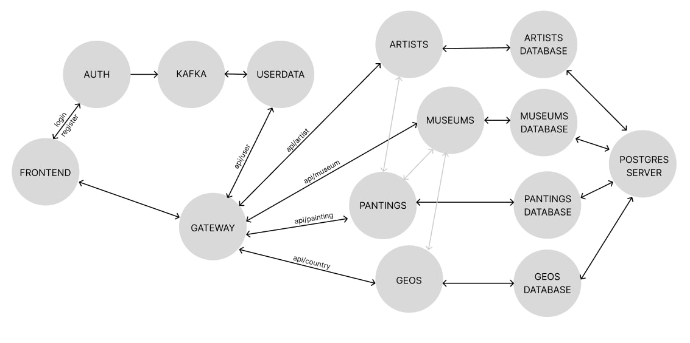

# Rococo

## HOW TO START


1. Запусить Doker
2. В корне проекта через bash выполнить команду  

```
 ./gradlew jibDockerBuild && docker compose up -d
```

3. После поднятия всех контейнеров перезапустить kafka (почему кооректно не стартует с первого раза) 

Фронт будет доступен по ссылке http://127.0.0.1:3000/


---
# Схема проекта



# Как запустить тесты

1. Из директории проекта "rococo-autotest" выполнить команду  

```
../gradlew test --quiet
```

2. После выполнение тестов для получения отчета выполнить команду

```
../gradlew allureReport --clean
```

Отчет будет находится в директори build/reports/allure-report/allureReport

# Используемые технологии и библиотеки
```
- Selenide
- Junit5
- JBDC
- io.grpc
- Allure
- com.github.romankh3:image-comparison - для скриншотных тестов
```

# Какие тесты были реализованы

  
